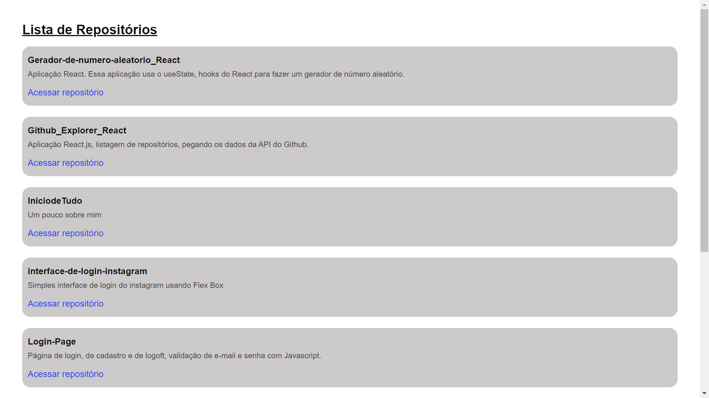

# 🚀 Github Explorer - React App

    Aplicação React.Js, este projeto é uma simples listagem de repositorios do Github através de sua API. 

Neste projeto utilizei os Hooks do React, useState, useEffect com sua junção para criar um novo hook, o <i>Axios</i> para fazer arequisiçaõ da API do Github, utilizei também o Typescript para dar tipagem aos componentes do React.js, este projeto abrenge alguns fundamentos do React.js, esta aplicação proporciona conhecimento e aprendizagem

## 🎯 Ilustração da aplicação

  

## 🔧 Ferramentas 

  <ul>
    <li>Vscode</li>
    <li>React.js</li>
    <li>React Hooks</li>
    <li>React Icons</li>
    <li>Axios</li>
    <li>Resquest API</li>
    <li>SASS</li>
    <li>Typescript</li>
  </ul>

## 👦 Autor

  Tiago Mota

  [LinkedIn](https://www.linkedin.com/in/tiago-mota-4690591a8/)
  [Gmail](thyagomotha2000@gmail.com)
