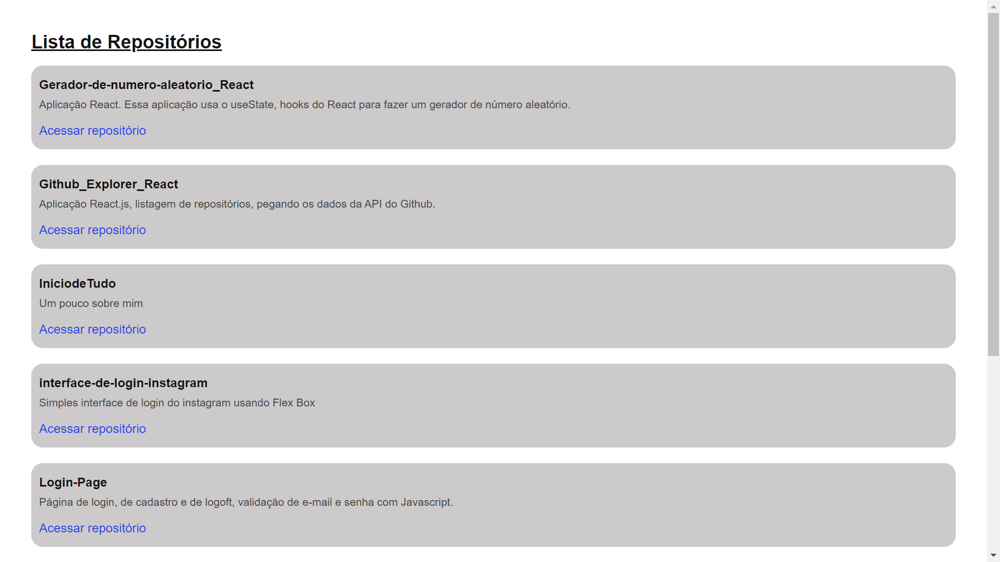

# Github Explorer - React App

    Aplicação com React.Js, nesta aplicação podemos ver uma listagem de reposositórios do Github. 

Neste projeto utilizei os Hooks do React, o <i>fetch</i> para interagir com a API do Github, utilizei também o Typescript para fazer a typagem dos componentes do React.js

## Ilustração da aplicação

  <h1 align="center">
   
  </h1>

## Ferramentas 

  <ul>
    <li>React.js</li>
    <li>useEffect</li>
    <li>useState</li>
    <li>Fetch</li>
    <li>API</li>
    <li>SASS</li>
    <li>Typescript</li>
  </ul>
